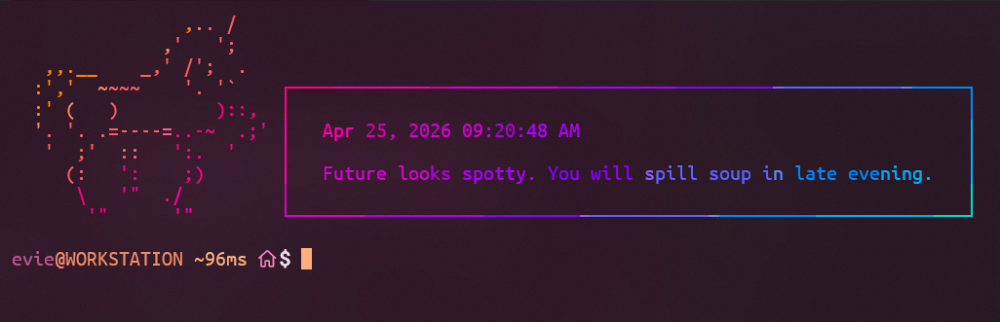

<div align="center">

<br />


# unicornsay

_Say something. A unicorn will deliver it._

[](https://www.gnu.org/software/bash/)
[](https://github.com/bats-core/bats-core)
[](LICENSE)

</div>

A single-file Bash script that wraps any message in a styled speech bubble beside a unicorn. Reads from an argument or stdin. Pipe anything through it.



## Usage

```bash
# Argument
unicornsay "Hello, world!"

# Stdin
echo "Build passed." | unicornsay

# Login greeting with fortune and lolcat
unicornsay "$(date "+%b %e, %Y %I:%M:%S %p"; echo; fortune)" | lolcat
```

## Options

| Flag           | Values          | Default | Description                                       |
| -------------- | --------------- | ------- | ------------------------------------------------- |
| `--above`      | —               | off     | Bubble above the unicorn instead of side-by-side. |
| `--art`        | `big`, `small`  | auto    | Art size. Auto-selected from terminal height.     |
| `--side`       | `left`, `right` | `left`  | Which side the unicorn appears on.                |
| `-h`, `--help` | —               | —       | Print usage and exit.                             |

Side-by-side layout requires at least 60 columns. Set `COLUMNS` and `LINES` to pin layout for scripts and CI.

## Tests

```bash
bats unicornsay.bats
```

Covers all 20 combinations of `--above`, `--art`, and `--side` with exact-output assertions at `COLUMNS=80 LINES=24`. Uses [bats-core](https://github.com/bats-core/bats-core).

> [!IMPORTANT]
> If you change the output layout, re-capture snapshots at `COLUMNS=80 LINES=24` and update the heredocs in `unicornsay.bats`.

#

<div align="center">

Made with ❤️ by [Evan Schoffstall](https://github.com/evanschoffstall)

</div>
